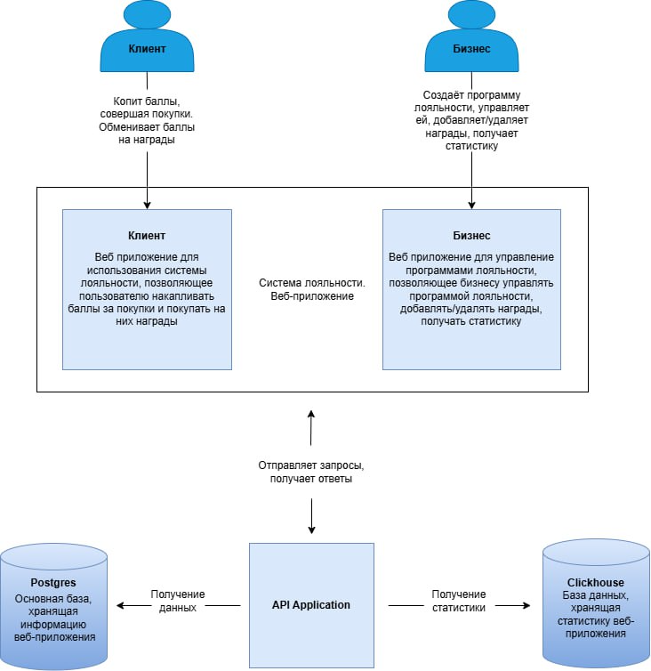
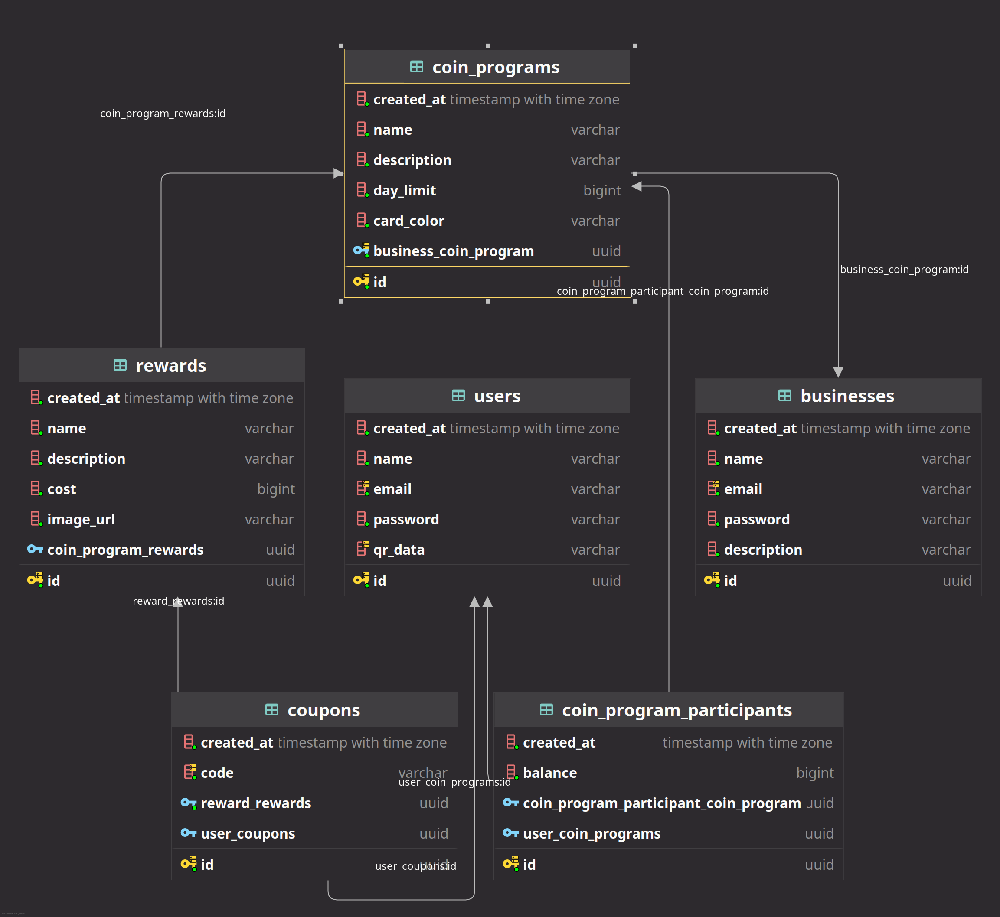
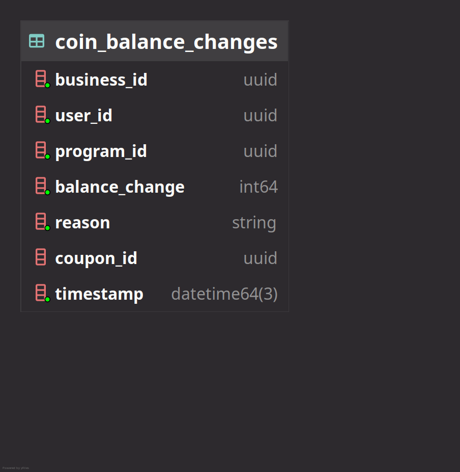

# LoyalT - Платформа управления программами лояльности

LoyalT - это платформа, предназначенная для создания и управления программами лояльности. Этот бэкенд-сервис
предоставляет надежный API для работы с операциями программ лояльности.

## Оглавление

- [Структура бэкенда](#структура-бэкенда)
- [Технологический стек](#технологический-стек)
- [Схемы баз данных](#схемы-баз-данных)
    - [Postgres](#postgres)
    - [ClickHouse](#clickhouse)
- [Конфигурация](#конфигурация)
- [Настройка окружения разработки](#настройка-окружения-разработки)
    - [Предварительные требования](#предварительные-требования)
    - [Локальная разработка](#локальная-разработка)
    - [Развертывание в продакшн](#развертывание-в-продакшн)
- [Документация API](#документация-api)
- [Тестирование](#тестирование)
    - [Покрытие тестами](#покрытие-тестами)
- [Логирование](#логирование)
- [Безопасность](#безопасность)
- [CI/CD](#cicd)
    - [Процесс CI/CD](#процесс-cicd-включает)
    - [Правила запуска пайплайна](#правила-запуска-пайплайна)
    - [Процесс деплоя](#процесс-деплоя)
    - [Лог успешного деплоя](#лог-успешного-деплоя-gitlab)
- [Лицензия](#лицензия)

## Структура бэкенда

```
.
├── cmd/                   # Точки входа в приложение
│   └── main.go            # Основная точка входа в приложение
├── internal/              # Внутренний код приложения
│   ├── adapters/          # Внешние слои и реализации
│   │   ├── app/           # Инициализация и настройка приложения
│   │   ├── config/        # Управление конфигурацией
│   │   ├── controller/    # HTTP обработчики и API эндпоинты
│   │   └── repository/    # Реализации хранения данных
│   └── domain/            # Бизнес-логика и основные сущности
├── pkg/                   # Публичные библиотеки, которые могут использоваться внешними приложениями
├── docs/                  # Файлы документации openapi
├── ssl/                   # SSL сертификаты
└── logs/                  # Логи приложения
```

1. **Доменный слой** (`internal/domain/`)
    - Содержит бизнес-логику и сущности
    - Определяет интерфейсы для внешних зависимостей

2. **Слой адаптеров** (`internal/adapters/`)
    - `controller/`: HTTP обработчики и API эндпоинты
    - `repository/`: Реализации баз данных
    - `app/`: Начальная загрузка и конфигурация приложения
    - `config/`: Управление конфигурацией

## Технологический стек

- **Язык**: [Go](https://go.dev/doc/)
    - [Echo](https://echo.labstack.com/) - веб-фреймворк
    - [EntGo](https://entgo.io/) - ORM для работы с базами данных
    - [Zap](https://pkg.go.dev/go.uber.org/zap) - логирование
    - [Swag](https://github.com/swaggo/swag) - генерация OpenAPI документации
- **Базы данных**:
    - [Postgres](https://www.postgresql.org/docs/) - основная база данных
    - [ClickHouse](https://clickhouse.com/docs) - для статистики и аналитики
- **Инфраструктура**:
    - [Docker](https://docs.docker.com/) - контейнеризация
    - [Docker Compose](https://docs.docker.com/compose/) - локальная разработка и развертывание
    - [Watchtower](https://containrrr.dev/watchtower/) - автоматическое обновление контейнеров
- **Документация**: [Swagger/OpenAPI](https://swagger.io/specification/v2/)



## Схемы баз данных

### Postgres



### ClickHouse



## Конфигурация

Приложение может быть настроено с помощью:

- Переменных окружения (файл `.env`)
- Конфигурационного файла (`config.yaml`)
- Флагов командной строки

## Настройка окружения разработки

### Предварительные требования

- Go 1.23.5
- Docker и Docker Compose

### Локальная разработка

1. Клонировать репозиторий
2. Скопировать `.env.example` в `.env` и настроить значения
3. Запустить окружение разработки:
   ```bash
   docker-compose -f dev-compose.yml up
   ```

### Развертывание в продакшн

Приложение может быть развернуто с помощью Docker Compose:

```bash
docker-compose -f compose.yml up -d
```

## Документация API

Документация API доступна по
адресу [/docs/index.html](https://prod-team-22-t62v97db.final.prodcontest.ru/api/v1/docs/index.html) при запущенном
приложении. API следует принципам REST и использует HTTPS для безопасной коммуникации.

Базовый URL: [/api/v1](https://prod-team-22-t62v97db.final.prodcontest.ru/api/v1`)

## Тестирование

Проект включает различные типы тестов:

- Модульные тесты
- Интеграционные тесты

Запуск тестов:

```bash
go test -v ./...
```

### Покрытие тестами

Команда для оценки покрытия тестами:

```bash
go test ./internal/domain/... ./internal/adapters/controller/api/... -coverprofile=coverage.out
go tool cover -func=coverage.out | grep "^total:\|%"
```

`total:                                                                                                  (statements)                            52.3%`

## Логирование

Приложение использует структурированное логирование с хранением файлов логов в директории `logs/`.

## Безопасность

- HTTPS/TLS шифрование (сертификаты в директории `ssl/`)
- Валидация входных данных
- Ограничение частоты запросов
- Безопасные заголовки
- Защита куки

## CI/CD

Проект использует [GitLab CI/CD](https://docs.gitlab.com/ee/ci/) для автоматизации процессов сборки и развертывания.

### Процесс CI/CD включает:

- **Сборка и публикация Docker-образа**:
    - Автоматическая сборка Docker-образа при изменениях в основной ветке (`main`)
    - Публикация образа в GitLab Container Registry
    - Использование Docker-in-Docker (DinD) для процесса сборки
    - Кэширование слоев Docker для ускорения сборки

- **Автоматическое развертывание**:
    - [Watchtower](https://containrrr.dev/watchtower/) отслеживает обновления образов в registry
    - При появлении нового образа автоматически производится обновление контейнера
    - Обеспечивает zero-downtime deployment

### Правила запуска пайплайна:

- Автоматический запуск при коммитах в ветку `main`
- Игнорирование изменений в конфигурационных файлах (`.env`, `compose.yml`, etc.)
- Запуск только при изменении кода проекта

### Процесс деплоя:

1. При пуше в `main` запускается сборка нового Docker-образа
2. Собранный образ публикуется в GitLab Container Registry
3. Watchtower, запущенный на production-сервере, обнаруживает новый образ
4. Происходит автоматическое обновление контейнера с приложением

Конфигурация CI/CD находится в файле [.gitlab-ci.yml](.gitlab-ci.yml).

## Лицензия

Все права на данное программное обеспечение защищены. Copyright 2025 АО «ТБанк» и авторы проекта.

Использование, копирование, модификация и распространение данного программного обеспечения возможно только с письменного
разрешения АО «ТБанк».

Подробная информация о лицензии находится в файле [LICENSE](LICENSE).
